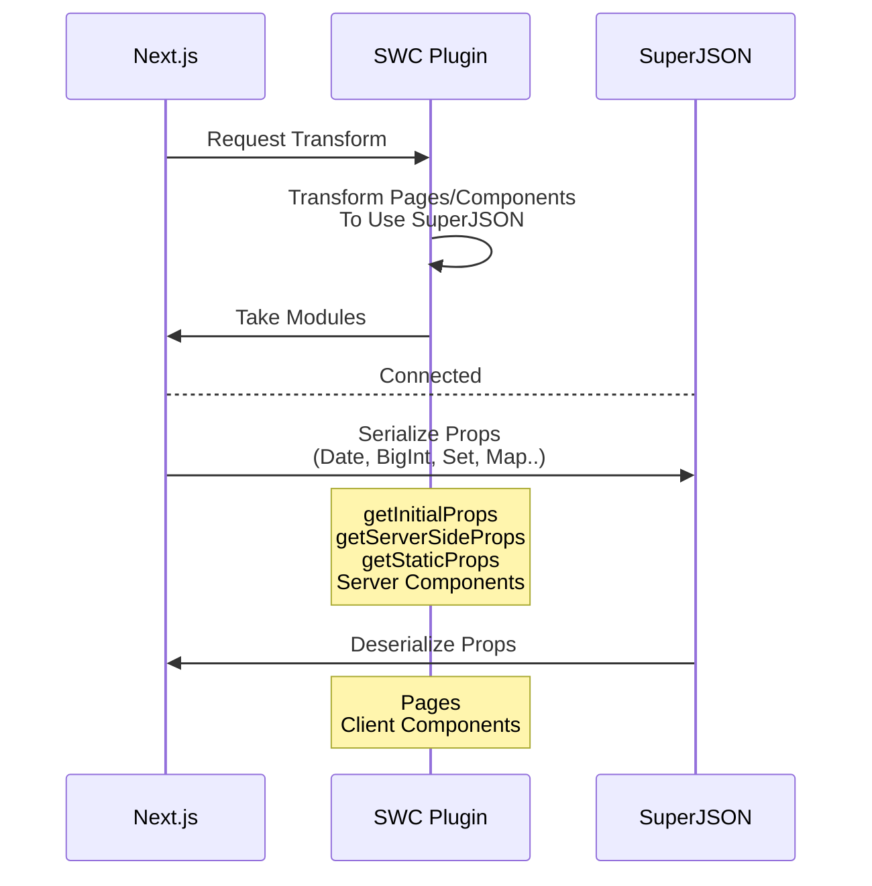

> [!NOTE]
> This is a fork of [next-superjson-plugin](https://github.com/blitz-js/next-superjson-plugin) that adds support for the latest versions of [Next.js](https://github.com/vercel/next.js).

<br>

<h1 align="middle"> Next SuperJSON Plugin</h1>
<h3 align="middle">🔌 SuperJSON Plugin for Next.js (SWC)</h3>

## Usage

Install packages first:

```sh
npm install superjson superjson-next
# or Yarn
yarn add superjson superjson-next
```

> [!IMPORTANT]
> Because of a bug in Next.js (see [#72019](https://github.com/vercel/next.js/issues/72019)), this plugin can only run in either app router or page router mode.

Add the plugin into `next.config.js`. And select the type of [Router](https://nextjs.org/docs#app-router-vs-pages-router) you are using.

```js
// next.config.js
module.exports = {
  experimental: {
    swcPlugins: [["superjson-next", { router: "APP" | "PAGE" }]],
  },
};
```

### /pages (Pages Directory)

```jsx
// For pages router no further configuration is required.

export default function Page({ date }) {
  return <div>Today is {date.toDateString()}</div>;
}

// You can also use getInitialProps, getStaticProps
export const getServerSideProps = () => {
  return {
    props: {
      date: new Date(),
    },
  };
};
```

- Allows pre-rendering functions to return props including [Non-JSON Values](https://github.com/blitz-js/superjson#parse)(Date, Map, Set..)

### /app (App Directory)

```jsx
// Use "data-superjson" attribute to pass non-serializable props to client components
// No needs to change the propsType of Client Component (It's type-safe!)

export default function ServerComponent() {
  const date = new Date();
  return <ClientComponent date={date} data-superjson />;
}
```

- Provides `data-superjson` attribute for [Server Component > Client Component Serialization](https://beta.nextjs.org/docs/rendering/server-and-client-components#passing-props-from-server-to-client-components-serialization).

### Options

You can use the `excluded` option to exclude specific properties from serialization.

```js
["superjson-next", { router: "APP" | "PAGE", excluded: ["someProp"] }],
```

## How it works



## Bug Report

⚠️ Keep in mind: SWC Plugin is still an experimental feature for Next.js

Plugin always ensures compatibility with [Next.js Canary version](https://nextjs.org/docs/messages/opening-an-issue) only.

[Leave an Issue](https://github.com/serg-and/superjson-next.git/issues)

## Special Thanks

- [kdy1](https://github.com/kdy1) (Main creator of swc project)
